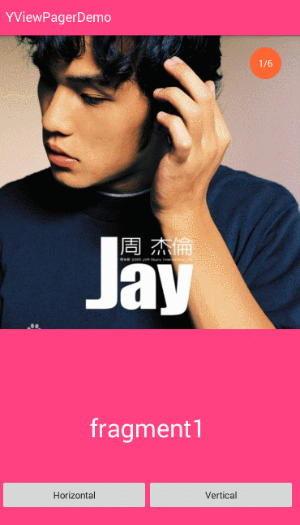
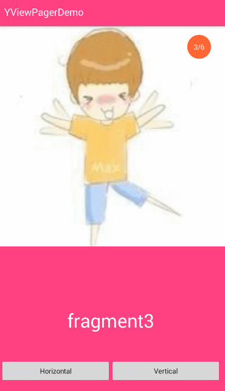

支持水平方向上滑动和竖直方向上的滑动，直接修改的官方提供的`ViewPager`的源码，注入了方向判断，使用起来和官方的`ViewPager`基本一样，还有监听事件也是一样的，支持`setOffscreenPageLimit()`可以放心滑动，以及`TabLayout`等。


开源地址：[https://github.com/open-android/ViewPager](https://github.com/open-android/ViewPager "开源项目地址")






* 详细的使用方法在DEMO里面都演示啦,如果你觉得这个库还不错,请赏我一颗star吧~~~

* 欢迎关注微信公众号、长期为您推荐优秀博文、开源项目、视频


## 使用步骤

### 1. 在project的build.gradle添加如下代码(如下图)

	allprojects {
	    repositories {
	        ...
	        maven { url "https://jitpack.io" }
	    }
	}


	

	
### 2. 在Module的build.gradle添加依赖

    compile 'com.github.open-android:ViewPager:0.1.0'


### 3.在xml复制如下代码
```
<cn.youngkaaa.yviewpager.YViewPager
    android:id="@+id/viewpager"
    android:layout_width="match_parent"
    android:layout_height="match_parent"
    app:orientation="vertical"/>
```

就像上面这样，只需要设置`app:orientation`属性，该属性可选值为:`vertical`和`horizontal`，分别代表竖直方向上滑动和水平方向上滑动。

### 也可以使用java代码

```
mViewPager.setDirection(YViewPager.VERTICAL);

mViewPager.setDirection(YViewPager.HORIZONTAL);

```

具体意思同上
注意，推荐在XML里面设置方向,请切记。

### 使用的ViewPager的适配器的时候需要继承YFragmentPagerAdapter
```
class FragmentAdapter extends YFragmentPagerAdapter {

        public FragmentAdapter(FragmentManager fm) {
            super(fm);
        }

        @Override
        public Fragment getItem(int position) {
            return mFragments.get(position);
        }

        @Override
        public int getCount() {
            return mFragments.size();
        }


    }

```

